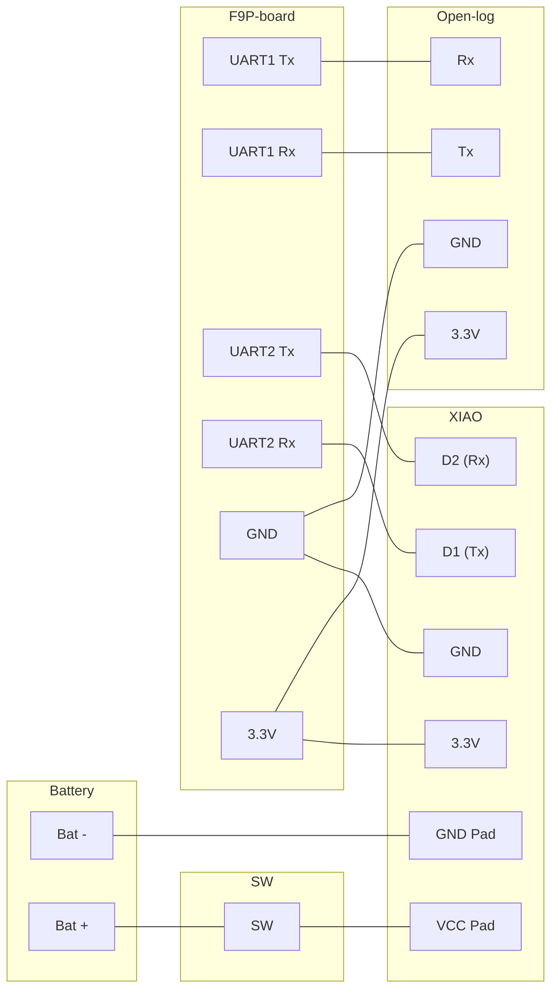

# 📡 Pocket F9P

`Pocket F9P`は`u-blox`社製の小型高精度GNSS受信機を手軽に、便利に持ち運べるように設計したコンパクト受信機です。

> [!IMPORTANT]
> 本リポジトリの内容を用いて行う一切の行為、被った損害・損失に対しては、一切の責任を負いかねます。 

# 🚀　Overview

- **バッテリー駆動、小型、高性能なGNSS受信機**: 小型、高性能な`u-blox F9P`をさらに使いやすく、Micro SDロガー・通信機能・バッテリーを備えたオールインワン小型受信機として設計
- **BLEを通じた通信、補正情報の利用に対応**: `GNSS Master`などのスマートフォン向けNTRIP通信アプリを介し受信機の測位結果をリアルタイムに受信可能、さらに`NTRIP`等による補正にも対応
- **用途に応じてマイコンボードをカスタマイズ可能**: 通信には小型マイコンである`Seeeduino XIAO`を用いており、ユーザは必要に応じて自由にアプリケーションを書き換え可能

**使用上の注意**
> [!WARNING]
> F9PのUSBポートに接続する際には、HWスイッチを必ず`オフ`にしてください。ボード（`XIAO ESP32C`か`u-blox F9P`、あるいは両方）が破損する可能性があります。

# ⚙️ Setup

以下に本受信機のセットアップ方法を示す。

## Hardware

### Print Case

[case](case/)ディレクトリ内にある3つのコンポーネントを3Dプリントする。

- [Pocket-F9P-Bottom.3mf](case/Pocket-F9P-Bottom.3mf): ケース上段（F9P基板）
- [Pocket-F9P-Center.3mf](case/Pocket-F9P-Center.3mf): ケース中央
- [Pocket-F9P-Top.3mf](case/Pocket-F9P-Top.3mf): ケース下段（ロガー、XIAO、バッテリー、HW SW）

### Assembly

> [!CAUTION]
> 先にXIAOの[Firmware書き込み](#write-firmware)を済ませることをおすすめします。

#### 接続図



#### Parts list

Parts                                                                                                                       |Qty|Description
----------------------------------------------------------------------------------------------------------------------------|---|-----------
[SparkFun GPS-RTK2 Board - ZED-F9P (Qwiic)](https://www.sparkfun.com/sparkfun-gps-rtk2-board-zed-f9p-qwiic-gps-15136.html)  |1  |GNSS受信機 (*1)
[Seeeduino XIAO ESP32C](https://www.seeedstudio.com/Seeed-XIAO-ESP32C3-p-5431.html)                                         |1  |バッテリー充電、BLE/NTRIPインタフェース
[SparkFun OpenLog](https://www.sparkfun.com/sparkfun-openlog.html)                                                          |1  |Micro SDロガー
[DATA POWER TECHNOLOGY DTP652533](https://www.sengoku.co.jp/mod/sgk_cart/detail.php?code=EEHD-67JP)                         |1  |リチウムイオンバッテリー
SMA to U.FL Cable                                                                                                           |1  |-
[NKK Switches SS-12SDP2](https://www.nkkswitches.co.jp/product/detailed/SS-12SDP2.html)                                     |1  |HWスイッチ
M3 x 5                                                                                                                      |2  |ケース固定用

***1**: 実際の組み立てには[SwitchScience ZED-F9P搭載GPS-RTKピッチ変換基板](https://www.switch-science.com/products/10511?_pos=4&_sid=bce749730&_ss=r)を使用した。

## Software

### Python setup

Pythonのセットアップは`uv`により行う。

```bash
cd pocket-f9p
uv sync
```

### XIAO ESP32C

#### Firmwareの書き込み

1. **Firmwareのダウンロード**: [MicroPython ESP32-C3](https://micropython.org/download/ESP32_GENERIC_C3/)より、Firmwareをダウンロードする。
ダウンロード後、本ディレクトリに移動する。
2. **Flashの消去**: 上記サイトの`Installation instructions`を参考に、まず`erase-flash`を行う。
3. **Firmwareの書込み**: その後、先の手順でダウンロードしたFirmwareを`write-flash`する。

##### Erase Flash

```bash
% esptool --port /dev/cu.usbmodem1101 erase-flash 
sptool v5.1.0
Connected to ESP32-C3 on /dev/cu.usbmodem1101:
Chip type:          ESP32-C3 (QFN32) (revision v0.4)
Features:           Wi-Fi, BT 5 (LE), Single Core, 160MHz, Embedded Flash 4MB (XMC)
Crystal frequency:  40MHz
USB mode:           USB-Serial/JTAG
MAC:                94:a9:90:7a:07:f8

Stub flasher running.

Flash memory erased successfully in 14.9 seconds.

Hard resetting via RTS pin...
```

##### Write Firmware

```bash
% esptool --port /dev/cu.usbmodem1101 --baud 460800 write-flash 0 ESP32_GENERIC_C3-20250911-v1.26.1.bin
esptool v5.1.0
Connected to ESP32-C3 on /dev/cu.usbmodem1101:
Chip type:          ESP32-C3 (QFN32) (revision v0.4)
Features:           Wi-Fi, BT 5 (LE), Single Core, 160MHz, Embedded Flash 4MB (XMC)
Crystal frequency:  40MHz
USB mode:           USB-Serial/JTAG
MAC:                94:a9:90:7a:07:f8

Stub flasher running.
Changing baud rate to 460800...
Changed.

Configuring flash size...
Flash will be erased from 0x00000000 to 0x001cffff...
Wrote 1898384 bytes (1159203 compressed) at 0x00000000 in 14.3 seconds (1062.0 kbit/s).
Hash of data verified.

Hard resetting via RTS pin...
```

#### Scriptの書き込み

MicroPythonのFirmwareを書込み後、次にスマートフォン／F9PをブリッヂするためのScriptをXIAOに書き込む。

1. **Extensionのインストール**: MARKETPLACEより[MicroPico`](https://marketplace.visualstudio.com/items?itemName=paulober.pico-w-go)をインストールする。
2. **XIAOとPCの接続**: USBケーブルでPCとXIAOを接続後、`VS Code`のコマンドパレットで`Shift + >MicroPico: Connect`を実行する。
3. **Scriptの書き込み**: [main.py](src/pocket_f9p/main.py)を開き、その状態から再度コマンドパレットを開き、`Shift + >MicroPico: Upload file to pico`を実行しXIAOにスクリプトをアップロードする。

### u-blox F9P

`u-blox F9P`のポート設定は以下のとおり。

Target  |Protocol in            |Protocol out           |Baudrate   |Dest.
--------|-----------------------|-----------------------|-----------|-----
UART1   |0+1+5 - UBX+NMEA+RTCM3 |0+1+5 - UBX+NMEA+RTCM3 |115200     |Logger
UART2   |0+1+5 - UBX+NMEA+RTCM3 |1 - NMEA               |38400      |XIAO

> [!NOTE]
> `UART2`の`Protocol out`に`UBX`を設定しても問題はないが、フルコンステレーションの場合1秒以内のデータ転送は難しい。

### Smartphone Application (Android)

本開発では[GNSS Master](https://www.gnssmaster.com/)を用いています。

#### GNSS Receiver Connection Setting

`GNSS Receiver Connection`右側の⚙️をタップし、以下を設定する。

- **Mode**: `Bluetooth LE`
- **Paired Devices**: `Pocket F9P`

#### Correction Input Setting

`Correction Input`右側の⚙️をタップし、必要に応じて補強情報データ配信元を設定する。

#### Receiver Data Output Setting

`Receiver Data Output`右側の⚙️をタップし、必要に応じて受信機データを再配信する設定を行う（TCP Server等）。

# 📖 How to use?

## 基本的な使い方

1. **受信機の電源を入れる**: 
    - バッテリー駆動の場合: `HWスイッチ`を`ON`にする
    - USBバスパワー駆動の場合: `XIAO`のUSBポートに電源供給する（同時にバッテリー充電したい場合は、`HWスイッチ`を`ON`にする）
2. **GNSS Masterを起動し、受信機と接続する**: 設定については[GNSS Receiver Connection Setting](#gnss-receiver-connection-setting)を参照
3. **GNSS MasterにてCorrection Inputを接続する（補正が必要な場合）**: 設定については[Correction Input Setting](#correction-input-setting)を参照

# 🤝 Contributor

- 開発: h-shiono
- 技術サポート:
    - 設計検討: Gemini
    - コーディング: Claude (Anthropic)
