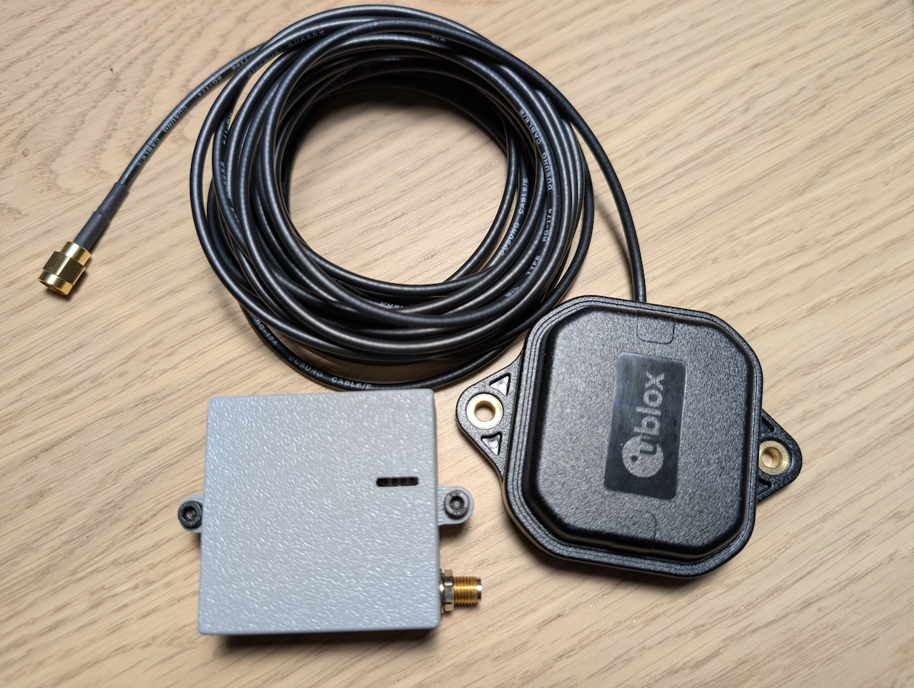
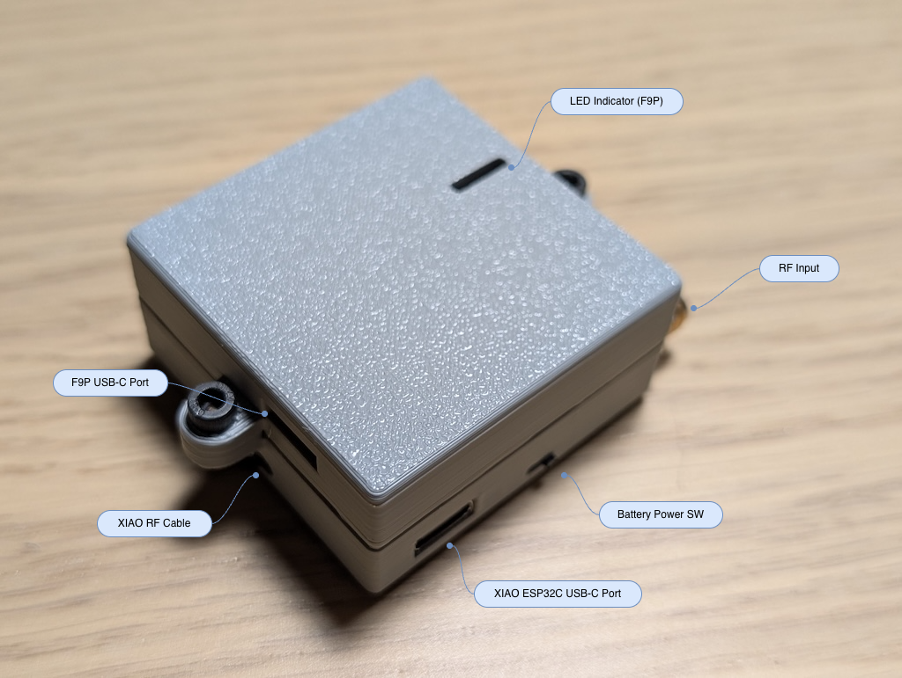
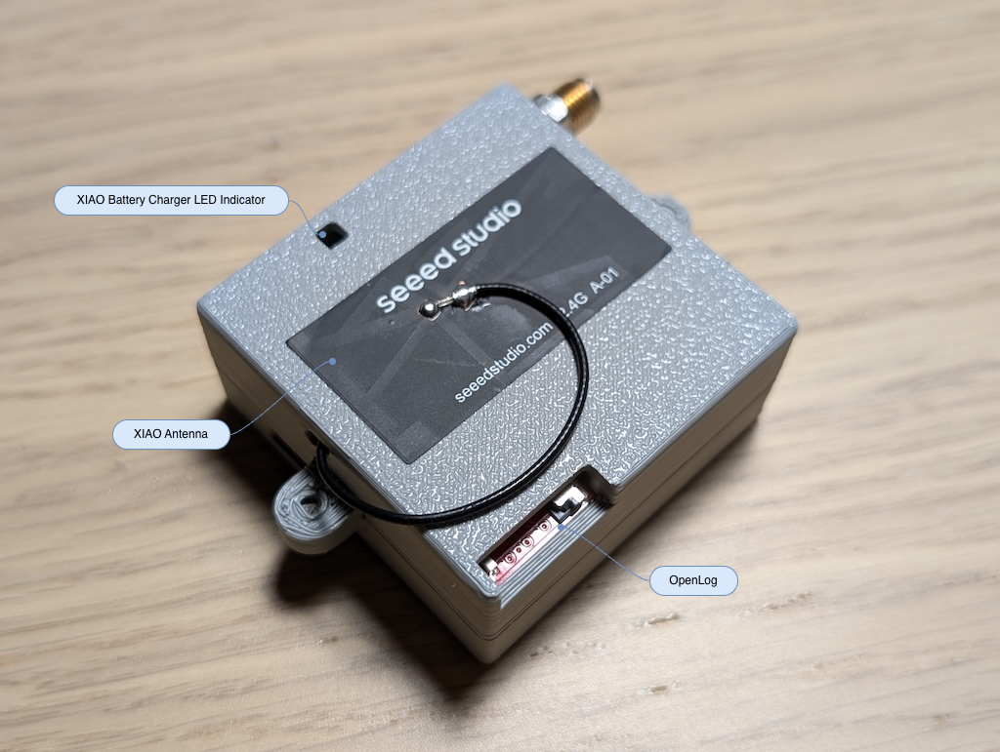
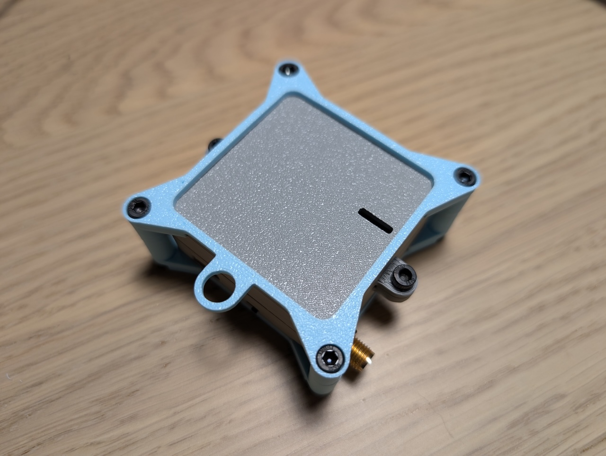
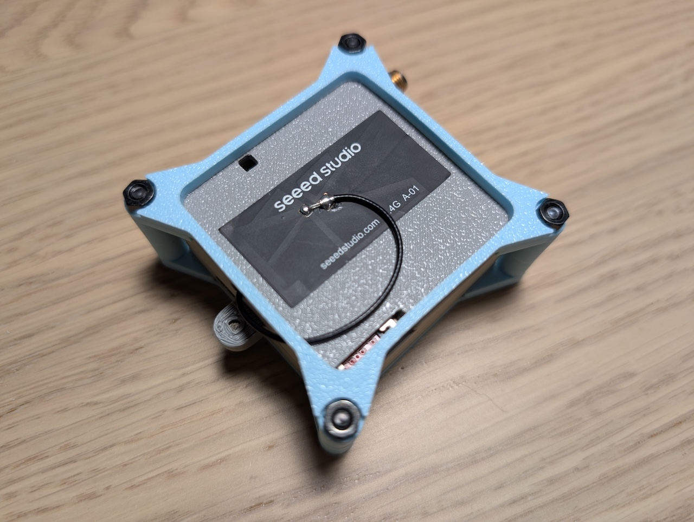
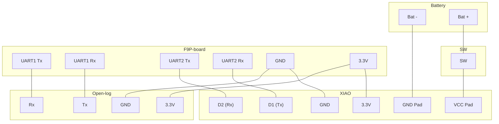
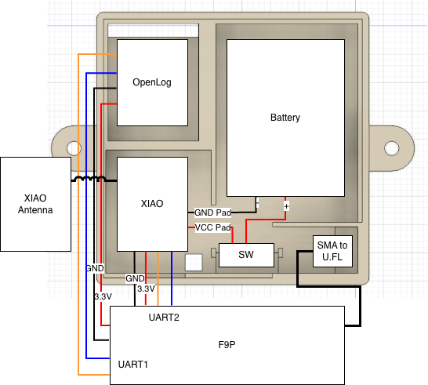
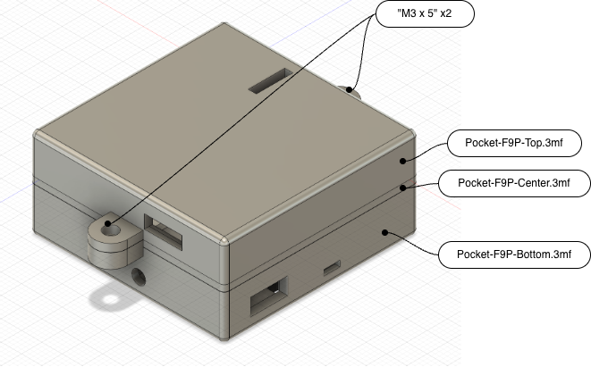

# 📡 Pocket-F9P

`Pocket-F9P` is a pocketable, all-in-one high-precision GNSS (F9P) receiver with a battery, data logger, and BLE (NTRIP) interface.

> [!IMPORTANT]
> ⚠️ We shall not be held responsible for any damage or loss incurred as a result of actions taken based on the information contained in this repository. 



[🇯🇵 README](README_jp.md)

## 🚀　Overview

- **Battery Driven, Compact, High-Accuracy GNSS Receiver:** Designed the compact (Approx. 48 mm x 48 mm x 22 mm) GNSS receiver to improve the usability of u-blox F9P, with Micro SD logger, communication and battery
- **Supports correction input via BLE:** By combining with the smartphone application such as `GNSS Master`, the receiver can utilize the correction data via `NTRIP`
- **Customizable microcontroller:** The microcontroller `Seeeduino XIAO` is utilized for the communication, so it’s easy to customize the application for user-dedicated objectives

**Important notes for use**
> [!WARNING]
> When you connect to the F9P usb port, you have to switch the hw switch `off`.
> The boards (`XIAO ESP32C`, `u-blox F9P` or both) will be damaged.


<br>


## ⚙️ Setup

This section describes how to setup the receiver.

### Hardware

##### Parts list

Parts                                                                                                                       |Qty|Description
----------------------------------------------------------------------------------------------------------------------------|---|-----------
[SparkFun GPS-RTK2 Board - ZED-F9P (Qwiic)](https://www.sparkfun.com/sparkfun-gps-rtk2-board-zed-f9p-qwiic-gps-15136.html)  |1  |GNSS Receiver
[Seeeduino XIAO ESP32C](https://www.seeedstudio.com/Seeed-XIAO-ESP32C3-p-5431.html)                                         |1  |Battery charger and BLE/NTRIP Interface
[SparkFun OpenLog](https://www.sparkfun.com/sparkfun-openlog.html)                                                          |1  |Micro SD Logger
[DATA POWER TECHNOLOGY DTP652533](https://www.sengoku.co.jp/mod/sgk_cart/detail.php?code=EEHD-67JP)                         |1  |Battery
SMA to U.FL Cable                                                                                                           |1  |SMA <-> U.FL Conversion
[NKK Switches SS-12SDP2](https://www.nkkswitches.co.jp/product/detailed/SS-12SDP2.html)                                     |1  |HW Switch
M3 x 5                                                                                                                      |2  |To secure the case
M3 x 25                                                                                                                     |4  |**Optional, Recommended** To secure the exoskeleton
M3 Nut                                                                                                                      |4  |**Optional, Recommended** To secure the exoskeleton

> [!NOTE]
> We utilized [SwitchScience ZED-F9P搭載GPS-RTKピッチ変換基板](https://www.switch-science.com/products/10511?_pos=4&_sid=bce749730&_ss=r) receiver for the prototyping.

#### Print the case

This repository provides two case options:

**v0.1.0 (Standard)**
The original compact case. *Note: The BLE antenna is exposed.*

- [Pocket-F9P-Top.3mf](case/Pocket-F9P-Top.3mf): Upper (F9P)
- [Pocket-F9P-Center.3mf](case/Pocket-F9P-Center.3mf): Center frame
- [Pocket-F9P-Bottom.3mf](case/Pocket-F9P-Bottom.3mf): Bottom (Logger, XIAO, Battery, HW Switch)

**v0.2.0 (with Exoskeleton)**
Recommended. Includes an external frame to protect the BLE antenna and add robustness.

- [Pocket-F9P-Top.3mf](case/Pocket-F9P-Top.3mf): Upper (F9P)
- [Pocket-F9P-Center.3mf](case/Pocket-F9P-Center.3mf): Center frame
- [Pocket-F9P-Bottom.3mf](case/Pocket-F9P-Bottom.3mf): Bottom (Logger, XIAO, Battery, HW Switch)
- [Exoskeleton-Top.3mf](case/Exoskeleton-Top.3mf)
- [Exoskeleton-Bottom.3mf](case/Exoskeleton-Bottom.3mf)


<br>


##### Wiring

Please refer to the following diagram and figure for wiring.

**Block Diagram**



**Wiring Image**



#### Assembly

> [!CAUTION]
> We recommend [Write Firmware](#write-firmware) before assembling.



### Software

#### Python setup

To setup the python environment, use uv:

```bash
cd pocket-f9p
uv sync
```

#### XIAO ESP32C

##### Write Firmware

1. **Download Firmware:** Download firmware from: [MicroPython ESP32-C3](https://micropython.org/download/ESP32_GENERIC_C3/), and move it to this directory
2. **Erase Flash:** Erase the flash by `erase-flash` option
3. **Write Firmware:** Then, write the binary which is downloaded in step 1 by `write-flash` option.

###### Erase Flash

```bash
% esptool --port /dev/cu.usbmodem1101 erase-flash 
sptool v5.1.0
Connected to ESP32-C3 on /dev/cu.usbmodem1101:
Chip type:          ESP32-C3 (QFN32) (revision v0.4)
Features:           Wi-Fi, BT 5 (LE), Single Core, 160MHz, Embedded Flash 4MB (XMC)
Crystal frequency:  40MHz
USB mode:           USB-Serial/JTAG
MAC:                94:a9:90:7a:07:f8

Stub flasher running.

Flash memory erased successfully in 14.9 seconds.

Hard resetting via RTS pin...
```

###### Write Firmware

```bash
% esptool --port /dev/cu.usbmodem1101 --baud 460800 write-flash 0 ESP32_GENERIC_C3-20250911-v1.26.1.bin
esptool v5.1.0
Connected to ESP32-C3 on /dev/cu.usbmodem1101:
Chip type:          ESP32-C3 (QFN32) (revision v0.4)
Features:           Wi-Fi, BT 5 (LE), Single Core, 160MHz, Embedded Flash 4MB (XMC)
Crystal frequency:  40MHz
USB mode:           USB-Serial/JTAG
MAC:                94:a9:90:7a:07:f8

Stub flasher running.
Changing baud rate to 460800...
Changed.

Configuring flash size...
Flash will be erased from 0x00000000 to 0x001cffff...
Wrote 1898384 bytes (1159203 compressed) at 0x00000000 in 14.3 seconds (1062.0 kbit/s).
Hash of data verified.

Hard resetting via RTS pin...
```

##### Write Script

After firmware writing, let's move on to the writing the application.

1. **Install Extension:** Install [MicroPico`](https://marketplace.visualstudio.com/items?itemName=paulober.pico-w-go) from MARKETPLACE
2. **Connect XIAO and Computer:** Connect XIAO and your computer with USB cable, then execute `Shift + >MicroPico: Connect` via `VS Code` command palette
3. **Write Script:** Open [main.py](src/pocket_f9p/main.py), then execute `Shift + >MicroPico: Upload file to pico` via command palette to upload the script to XIAO

#### u-blox F9P

The ports settings of F9P are as follows:

Target  |Protocol in            |Protocol out           |Baudrate   |Dest.
--------|-----------------------|-----------------------|-----------|-----
UART1   |0+1+5 - UBX+NMEA+RTCM3 |0+1+5 - UBX+NMEA+RTCM3 |115200     |Logger
UART2   |0+1+5 - UBX+NMEA+RTCM3 |**1 - NMEA**           |**38400**  |XIAO

> [!NOTE]
> - Our firmware supports **NMEA output only**
> - Set `1 - NMEA` for UART2 protocol out
>   - It is okay to set `0+1+5 - UBX+NMEA+RTCM3` for UART2 protocol out, however it's difficult to forward the whole data within 1 sec when using full GNSS constellations
> - We recommended the baudrate 38400bps, but the firmware can detect it automatically (supports 9600/38400/115200/57600/19200/230400 bps)

### 📱 Setup (Smartphone, Android)

#### Application (GNSS Master)

We utilized [GNSS Master](https://www.gnssmaster.com/) for this development.

##### GNSS Receiver Connection Setting

Tap ⚙️ on the right side of `GNSS Receiver Connection`, and set the following:

- **Mode:** `Bluetooth LE`
- **Paired Devices:** `Pocket-F9P`

##### Correction Input Setting

Tap ⚙️ on the right side of `Correction Input`, and setting it if needed.

##### Receiver Data Output Setting

Tap ⚙️ on the right side of `Receiver Data Output`, and setting it if needed.

#### Other settings (Developer Mode, etc.)

- **Enabling Developer mode:** see [Configure on-device developer options](https://developer.android.com/studio/debug/dev-options?hl=en)
- **Select mock location app:** see [Debugging](https://developer.android.com/studio/debug/dev-options?hl=en#debugging)

## 📖 How to use?

### Basic usage

1. **Power on the receiver:** 
    - Battery Driven: Switch `ON` the HW Switch
    - Using USB Bus Power: Connect the usb cable to the `XIAO`'s port, if you want to charge the battery, you should switch `ON` the HW switch as well
2. **Start GNSS Master and Connect to the receiver:** see [GNSS Receiver Connection Setting](#gnss-receiver-connection-setting)
3. **Connect the Correction Input (If needed):** see [Correction Input Setting](#correction-input-setting)

## 🧠 LLM Utilization

- Design Review: Gemini
- Coding Assistant: Claude (Anthropic)

## 🤝 Contributing

We welcome bug reports, feature suggestions and pull requests.

1.  Please create an issue to report the problem.
2.  When submitting the PR, clearly describe the changes made.

## ⚠️ Known Issues & Limitations

- **Prototype Quality:** This HW and SW are prototype, therefore we have not performed sufficient verification
    - **XIAO Antenna Exposure:** The XIAO's BLE antenna and its cable are exposed on the outside of the case. This poses a risk to long-term robustness and potential snagging of the cable. (✅ `v0.2.0`: Add exoskeleton frame)
- **Application Dependency:** We checked the application compatibility only with `GNSS Master`
- **NTRIP Correction:** We have not verified the NTRIP correction
- **Regarding GNSS Status view in GNSS Master:** We confirmed the following issues, but we do not verify the further details:
    - The UTC time does not update for several seconds
    - Sometimes `No NMEA RMC` is shown

## 📄 License

This project is licensed under the [MIT License](LICENSE).
(3D data files are licensed under [CC BY-SA 4.0](https://creativecommons.org/licenses/by-sa/4.0/))
